# OpenCinema

## Open creative tools that remember how to make better media.

OpenCinema is an open creative ecosystem for AI-native filmmaking.

Its first focused experience is **Manga Studio**: a creator gives an AI agent a story, the agent turns it into a structured manga scene, Livepeer Agent generates the media, a critic identifies what failed, and CineGraph preserves the useful lesson so the next attempt can use it.

The aim is simple:

> Every creative attempt should make the next attempt—and eventually the next creator—smarter.

## The problem

Generative tools are powerful but forgetful.

A creator may spend dozens of generations teaching a system to preserve a character’s hairstyle, scar, clothing, props, or emotional arc. The next scene often starts from zero. The learning is trapped inside a prompt, a chat session, or an application that another agent cannot inspect or reuse.

That makes AI creative work look like this:

```text
prompt -> generation -> output -> forgotten
```

OpenCinema is aiming for this instead:

```text
intent -> plan -> generate -> evaluate -> learn -> retrieve -> generate better
```

## The product in one demo

The first proof is a four-panel dark seinen manga scene:

> A wounded swordsman reaches an abandoned mountain shrine during a storm. He realizes the man he has been hunting is already waiting inside.

The creator should be able to see:

1. The Director turning the story into a structured `ScenePlan`.
2. A first manga artifact generated through Livepeer Agent.
3. An independent critic identifying character, style, continuity, composition, and storytelling issues.
4. A structured lesson created from that evaluation.
5. The lesson written to an OriginTrail DKG Knowledge Asset.
6. The exact knowledge retrieved and shown before the next generation.
7. The Director composing a revised instruction from that knowledge.
8. Try 1 and Try 2 compared side by side, with their lineage visible.

The important proof is not a higher score by itself. The important proof is:

```text
Try 1 -> evaluation -> lesson -> DKG readback -> revised direction -> Try 2
```

The interface must show exactly which `CharacterIdentity`, `StyleIdentity`, `ImprovementLesson`, or `ModelObservation` changed Try 2.

## OpenCinema, CineGraph, and Manga Studio

These are three layers of one product, not three separate products.

```text
OpenCinema
  open AI-native creative ecosystem
          |
          v
Manga Studio
  first creator-facing workflow
          |
          v
CineGraph
  creative knowledge, retrieval, provenance, and lineage
          |
          v
OriginTrail DKG
  structured, selectively shared, verifiable memory
```

### OpenCinema

The user-facing ecosystem. It will eventually support manga, storyboards, shot design, generated video, short films, and collaborative cinema.

### CineGraph

Our creative intelligence layer. CineGraph defines the domain model, retrieval rules, provenance conventions, lesson format, privacy scopes, and the protocol by which agents use prior creative knowledge.

### Manga Studio

The first narrow application. Manga makes visual drift easy to see: characters change, clothing disappears, panels lose geography, and emotional progression becomes unclear. That makes it an excellent environment for proving that structured memory changes creative decisions.

## Why Livepeer Agent

Livepeer is the media execution layer. OpenCinema should not become a second model router, renderer, or media-infrastructure company.

Livepeer Agent gives the application one MCP interface for discovering capabilities, checking pricing, generating media, uploading inputs, tracking jobs, and reporting cost. Underneath, Livepeer is a decentralized compute marketplace: gateways dispatch work to GPU operators that advertise capability, price, latency, reliability, and stake.

At runtime, OpenCinema will:

1. Discover available capabilities.
2. Describe the selected capability before its first use.
3. Compare price and expected latency.
4. Generate with an idempotency key and attempt session ID.
5. Poll asynchronous jobs without duplicating billed work.
6. Record the capability, served model, job reference, output reference, cost, and artifact hash.

Model names and prices must remain runtime data. The current Livepeer registry is live and changes over time.

Read the current integration guidance in [docs/research/LIVEPEER.md](docs/research/LIVEPEER.md) and the [Livepeer Agent Get Started guide](https://agent.livepeer.org/get-started.html).

## Why OriginTrail DKG

OriginTrail DKG gives CineGraph a structured memory layer that can outlive one session or application.

The intended trust gradient is:

```text
Working Memory
  private drafts and local iteration
        |
        v
Shared Working Memory
  selectively shared project knowledge
        |
        v
Verifiable Memory
  published Knowledge Assets with durable provenance
```

Manga Studio will not publish everything. Raw prompts, unreleased scripts, private creative notes, large media files, credentials, wallet material, and personal information remain private or local. A shared lesson may contain a short semantic observation, stable identifiers, hashes, provenance, and a recommendation that another agent can safely use.

Testnet publication is a possible evidence upgrade. It is not a substitute for showing the working create, retrieve, query, and readback path. If an asset is published, the README and demo will record its UAL, network, and verification evidence.

Read [docs/research/ORIGINTRAIL.md](docs/research/ORIGINTRAIL.md) and the [OriginTrail publish and query guide](https://docs.origintrail.io/use-dkg/publish-and-query).

## The CineGraph knowledge model

The first ontology will represent:

- `CreativeProject`
- `ScenePlan`
- `PanelPlan`
- `CharacterIdentity`
- `StyleIdentity`
- `GenerationAttempt`
- `Artifact`
- `ArtifactProvenance`
- `Evaluation`
- `ImprovementLesson`
- `CreativeTechnique`
- `ModelObservation`
- `Remix`

The key relationship is:

```text
GenerationAttempt(try-2)
  USED_KNOWLEDGE
ImprovementLesson(hair-and-eye-scar-anchor)
```

That relationship makes the DKG integration meaningful. It records not only that knowledge existed, but that the next agent decision actually used it.

## Architecture

```mermaid
flowchart LR
    User[Creator story and intent] --> Director[AI Director]
    Director --> Plan[ScenePlan]
    Plan --> Livepeer[Livepeer Agent]
    Livepeer --> Artifact[Try 1 artifact]
    Artifact --> Critic[Independent critic]
    Critic --> Lesson[ImprovementLesson]
    Lesson --> DKG[OriginTrail DKG]
    DKG --> Retrieval[CineGraph retrieval]
    Retrieval --> Director2[Revised Director instruction]
    Director2 --> Livepeer2[Livepeer Agent]
    Livepeer2 --> Artifact2[Try 2 artifact]
    Artifact2 --> Compare[Comparison and provenance]
```



The system will keep clear boundaries:

- **Director:** translates intent into structured production decisions.
- **Media provider:** executes media work through Livepeer Agent.
- **Critic:** evaluates the artifact against preregistered criteria without seeing hidden memory or prompt history.
- **CineGraph:** stores and retrieves structured creative knowledge.
- **Artifact store:** keeps output references and hashes, not bulk media in the DKG.
- **Run ledger:** preserves immutable attempt evidence and lineage.

Every attempt is persisted before expensive work begins. A failed remote job must not erase the attempt, and Try 2 must never mutate Try 1.

## Evidence, not theater

OpenCinema will not claim that “CineGraph improved quality by 25%” from an LLM judge score alone.

The evidence frame defines the stronger claim we can actually defend:

> In `n` held-out cases, OpenCinema completed `x/n` real Livepeer-plus-DKG loops and retrieved named lessons that changed `y/n` next Director instructions.

The evaluation contract requires:

- Held-out cases disjoint from prompt examples and development fixtures.
- A mechanical fingerprint check for that separation.
- A critic that sees only the target and artifact.
- Failures included in denominators.
- Percentages reported with `n` and denominator.
- A timed manual baseline before the demo.
- No claim that a changed prompt automatically means a better artifact.

The proposed frame is recorded in [docs/EVIDENCE-FRAME.md](docs/EVIDENCE-FRAME.md), with the supporting [evidence ledger](docs/research/EVIDENCE-LEDGER.md).

## Current status

This repository is at the research and product-foundation stage. The OpenCinema application has not yet been implemented.

The production architecture for CineGraph is defined in the [architecture selection](docs/superpowers/specs/2026-09-16-cinegraph-architecture-selection.md), [context graph design](docs/superpowers/specs/2026-09-16-cinegraph-context-graph-design.md), and [implementation plan](docs/superpowers/plans/2026-09-16-cinegraph-context-graph.md). The selected design uses an immutable, bitemporal, content-addressed event core with PostgreSQL transactions, canonical RDF/JSON-LD projections, governed evidence storage, derived retrieval indexes, and OriginTrail DKG as the controlled distribution and verification layer.

The validated work so far is:

- Current Livepeer Agent capabilities, pricing, and invocation behavior researched.
- OriginTrail DKG v10 memory layers and Knowledge Asset lifecycle researched.
- Organizer workshop recording reviewed end to end.
- Official workshop reference application cloned and inspected.
- Reference application run locally in mock mode.
- Reference tests passed: 9 tests.
- Reference production build passed.
- Reference browser flow verified: Try 1 scored 6/10; Try 2 with DKG memory scored 8/10.

Mock mode is useful for interface and state-machine development. It is not evidence of a real Livepeer or DKG integration.

See [docs/research/REFERENCE-APP.md](docs/research/REFERENCE-APP.md) and [docs/research/REUSE-MAP.md](docs/research/REUSE-MAP.md).

## Planned vertical slices

The implementation will be built as independently testable slices:

1. Research and real integrations verified.
2. Story to structured Director scene plan.
3. Scene to real Livepeer artifact.
4. Artifact to independent critic.
5. Critic to CineGraph Knowledge Asset.
6. DKG query to relevant knowledge retrieval.
7. Retrieved lesson to Try 2.
8. Try comparison and knowledge-used UI.
9. Small CineGraph explorer.
10. Explore, Remix, polish, README, deployment, and demo.

No wallet product, token, NFT marketplace, DAO, full manga editor, video timeline, mobile app, or large social feed belongs in the MVP before the memory loop works.

## Design direction

OpenCinema should feel like professional creative software:

- Artifact-first, with the generated manga page dominating the workspace.
- Editorial, cinematic, and calm.
- A serious production tool, not a Web3 dashboard.
- Clear inspector panels for Director, character, style, critic, CineGraph, and provenance.
- A visible bottom rail showing `Try 1 -> Critic -> Lesson -> Try 2`.
- Privacy scope visible wherever knowledge is created or shared.

## Research and source material

- [Hackathon rules and Track 2 requirements](docs/research/HACKATHON-RULES.md)
- [Livepeer Agent research](docs/research/LIVEPEER.md)
- [OriginTrail DKG research](docs/research/ORIGINTRAIL.md)
- [CineGraph production architecture selection](docs/superpowers/specs/2026-09-16-cinegraph-architecture-selection.md)
- [CineGraph context graph design](docs/superpowers/specs/2026-09-16-cinegraph-context-graph-design.md)
- [CineGraph production implementation plan](docs/superpowers/plans/2026-09-16-cinegraph-context-graph.md)
- [Workshop notes](docs/research/LIVEPEER-WORKSHOP-NOTES.md)
- [Reference app analysis](docs/research/REFERENCE-APP.md)
- [Reuse map](docs/research/REUSE-MAP.md)
- [Evidence frame](docs/EVIDENCE-FRAME.md)
- [Livepeer Agent Get Started](https://agent.livepeer.org/get-started.html)
- [Livepeer network](https://docs.livepeer.org/network)
- [OriginTrail DKG quickstart](https://docs.origintrail.io/getting-started/quickstart)
- [OriginTrail DKG Hello World](https://github.com/OriginTrail/dkg-hello-world)
- [Workshop reference application](https://github.com/its-DeFine/livepeer-dkg-iteration-lab)
- [Organizer workshop recording](https://www.youtube.com/watch?v=DPuEDwK1bT0)

## License

An open-source license will be added before the public project submission.
