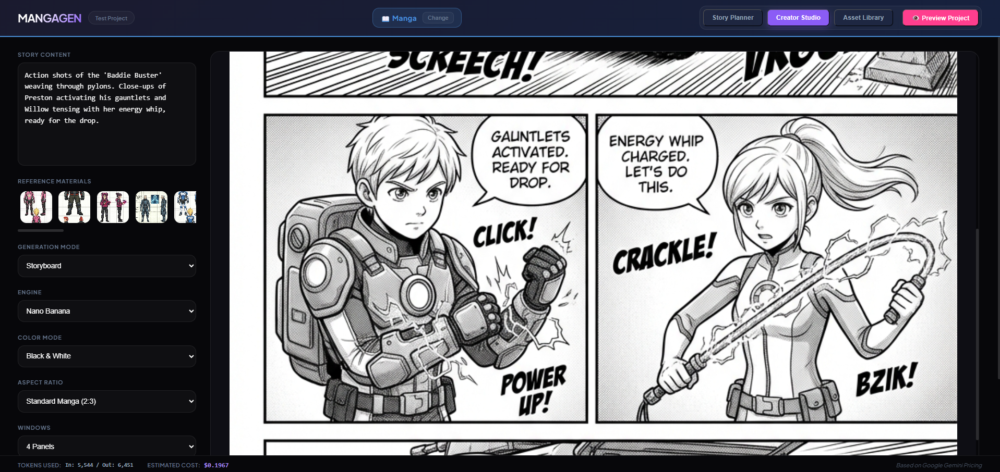

# MangaGen



MangaGen is a local-first workspace for planning, generating, editing, assembling, importing, and exporting manga pages and illustrated storybooks. It stores project metadata and generated assets on disk, serves the app through an Express backend, and routes AI work through configurable providers instead of hardcoded per-screen model choices.

## Changes since the last release

This branch updates the older Gemini/Nano Banana release into a more portable, provider-routed local app.

- Added an Express backend app with validated filesystem storage, project metadata persistence, static production serving, and local-only browser origin protection.
- Added an in-app AI Settings dashboard with provider tabs for Google, OpenAI, OpenRouter, and custom OpenAI-compatible endpoints.
- Added editable API keys, base URLs, model IDs, provider capabilities, generation defaults, operation routes, and cost estimates inside the app UI.
- Replaced per-page Basic/Pro, Flash/Pro, and Engine selectors with operation routes configured once in AI Settings.
- Split AI routing by operation: story planner, storyboard text, page image, panel image, and image edit.
- Added route-based cost estimates so the usage footer is no longer tied to Google-labeled pricing.
- Added project import and export as portable `.mangagen.zip` bundles.
- Added Docker deployment as a single local container with persistent `/data` storage.
- Added generation history storage for prompts, references, usage, outputs, timestamps, and route metadata.
- Added persistent batch queue state for page generation status.
- Added project-scoped asset buckets for characters, locations, style references, and generated pages.
- Updated saved projects to schema v2 with generated asset references instead of embedded base64 blobs.
- Added storybook booklet data, cover assets, richer export behavior, and helper tests around text normalization and imposition.
- Added automated server and shared client helper tests.
- Added production build checks and bundle splitting around heavier editor/export views.

## Local-first status

This repository is currently designed for local use.

- Project data uses `schemaVersion: 2`.
- Generated and uploaded page images are stored as files under `projects/<project-id>/pages/`.
- Global AI settings are stored under `settings/ai-config.json` in the app data root.
- Provider API keys are saved locally and are never returned to the frontend after save.
- Existing pre-v2 project folders are intentionally not supported. Delete old local projects or import/export through a compatible build.

## Stack

- Frontend: React 19 + Vite
- Backend: Express 5 + local filesystem storage
- AI: Provider-routed adapters for Google Gemini, OpenAI, OpenRouter, and custom OpenAI-compatible endpoints
- Canvas and layout tools: Konva, react-konva
- Storybook editor/export: TipTap, html2canvas, jsPDF
- Tests: Node test runner
- Deployment: Local Node process or single Docker container

## Folder layout

- `server/`: Express app, validation, storage, AI settings, AI provider routing, history, and portability services
- `src/`: React app and shared client helpers
- `tests/`: server and shared-helper tests
- `projects/<project-id>/project.json`: project metadata and planned pages
- `projects/<project-id>/pages/`: generated or uploaded page images
- `projects/<project-id>/characters/`: project-scoped character references
- `projects/<project-id>/locations/`: project-scoped location references
- `projects/<project-id>/style/`: project-scoped style references
- `projects/<project-id>/generation-history.json`: prompt, usage, route, reference, and output audit history
- `characters/`, `locations/`, `style/`: optional root-level local asset buckets
- `settings/ai-config.json`: global provider, route, defaults, and cost estimate settings
- `Dockerfile`: production container build

## Setup

1. Install dependencies.

```bash
npm install
```

2. Start the backend and frontend together.

```bash
npm run launch
```

Frontend: [http://localhost:5173](http://localhost:5173)
Backend: [http://localhost:3001](http://localhost:3001)

3. Open a project, then use Project -> Settings to configure AI providers.

You can enter or replace API keys, base URLs, model IDs, route assignments, defaults, and cost estimates from the in-app AI Settings dashboard. Saved settings are written locally under `settings/ai-config.json`.

## Scripts

- `npm run launch`: run the Express server and Vite dev server together
- `npm run server`: run only the backend
- `npm run dev`: run only the Vite frontend
- `npm run build`: production build check
- `npm test`: run server and shared-helper tests
- `npm start`: run the production Express server entry point

## Docker

Build and run MangaGen as a single local-first container:

```bash
docker build -t mangagen .
docker run -p 3001:3001 -v mangagen-data:/data mangagen
```

Open [http://localhost:3001](http://localhost:3001).

The container stores projects, library assets, generated pages, generation history, batch queue state, and global AI settings under `/data`.

Configure provider keys and routes from Project -> Settings in the app after the container starts.

## AI providers and routes

Open AI Settings from the Project menu to configure credentials, provider capabilities, model IDs, operation routes, generation defaults, and cost estimates. This dashboard is the primary configuration surface.

Supported provider options:

- Google: Gemini text, image generation, and image editing behavior.
- OpenAI: text routing and image routes through OpenAI image-capable APIs.
- OpenRouter: OpenAI-compatible text/chat routing.
- Custom: OpenAI-compatible local or private endpoint, such as LM Studio, Ollama gateway, vLLM, or similar tools.
- Livepeer Agent: image generation through the Livepeer Agent MCP endpoint. Set `LIVEPEER_AGENT_API_KEY` and restart the server; current Livepeer responses may require a `pymthouse` composite key (`app_<appId>_pmth_<token>`) rather than retired `sk_...` keys.

Operation routes:

- Story Planner: text route for turning a story into planned pages.
- Storyboard JSON: text route for manga storyboard blueprints.
- Page Images: image route for full page or storybook illustration generation.
- Panel Images: image route for individual manga panel generation.
- Image Editing: image route for edit and insert workflows.

Planner, Creator, panel generation, and image editing no longer ask users to choose Basic/Pro, Flash/Pro, or Engine. Creative controls remain in the generation UI, while provider and model routing live in AI Settings.

## Cost estimates

The usage footer uses the configured cost estimates for the route that handled each AI response. Each route stores:

- input token cost
- output token cost
- image or output flat cost

These numbers are estimates, not a billing ledger. Update them in AI Settings to match the provider and model pricing you actually use.

## Project portability

Use Export Project from the Project menu or project list to download a `.mangagen.zip` bundle. The bundle includes:

- `mangagen-export.json` manifest
- `project.json`
- project asset folders
- asset metadata JSON files
- generated page images
- booklet data
- generation queue state
- `generation-history.json`

Exports do not include global AI settings or provider secrets.

Use Import Project on the project selector to restore a bundle. If the project ID already exists, MangaGen imports it with a conflict-safe suffix.

## Storage model

Projects persist file references instead of embedding base64 image blobs in `project.json`.

Each saved page can include:

```json
{
  "generatedAsset": {
    "bucket": "pages",
    "filename": "page-001.png",
    "url": "/projects/my-book/pages/page-001.png",
    "mimeType": "image/png",
    "updatedAt": "2026-03-09T12:00:00.000Z"
  }
}
```

The server stores the file on disk and only persists the metadata needed to rehydrate that asset later. Inline image payloads are treated as transient UI state and are stripped before project metadata is saved.

## Core workflows

### Story Planner

- Paste a story, analyze it into a reviewable story bible, and split approved story material into page/panel thumbnails.
- Edit the visible Manga Production Brief and preserve a multi-chapter series with versioned continuity data.
- Approve thumbnails before Draw Art is enabled; each panel is generated with chapter, page, neighboring-panel, and story-bible context.
- Use global defaults for mode, color, aspect ratio, style, and text density.
- Edit planned pages and creative settings without choosing provider/model per page.
- Batch-generate pages and keep queue status in project metadata.
- Review recent AI runs from generation history.

### Creator Studio

- Generate manga storyboard blueprints or full page art.
- Draw individual panels from a storyboard.
- Select layouts, preview page assembly, and finalize manga pages.
- Edit generated page or panel images through the image editor.
- Save outputs to the project library and sync them back to the planner.
- Persist panel generations automatically with revisions and lineage metadata. Dialogue, captions, and SFX remain editable overlay data.

### Storybook Assembler

- Assemble storybook pages with rich text overlays.
- Edit typography, colors, alignment, covers, and booklet settings.
- Export pages, full PDFs, and booklet PDFs.

### Asset Library

- Upload project-scoped characters, locations, and style references.
- Store metadata such as display name, role/type, usage, and notes.
- Use references in planner and creator workflows.

## Verification

Current checks used for this release pass:

```bash
npm test
npm run build
docker build -t mangagen .
```

The automated tests cover API behavior, AI settings migration, provider route errors, route metadata, project import/export, path safety, asset persistence, schema hydration, story extraction, storybook text normalization, and booklet imposition math. Full interactive planning/generation/editing workflows should still be smoke-tested manually with your configured providers.

### Livepeer image failures

Livepeer panel output is decoded and checked for valid dimensions and non-blank pixels before it is saved. A corrupt, undersized, uniform, or near-black response is retried once with a new idempotency key. If the retry also fails, the panel is marked `failed` with a structured error such as `IMAGE_BLANK`; no invalid image is presented as a successful panel.

The local API only accepts browser requests from localhost origins and validates project IDs, asset buckets, and filenames. Responses include an `X-Request-Id` for troubleshooting. Generation jobs are capped by `MANGAGEN_MAX_ACTIVE_JOBS`, persisted in the project, and resumed by the server after restart. Project exports provide a local backup of project metadata and assets.

## Notes

- Project IDs are slugified from the project name and must remain filesystem-safe.
- Asset saves are bucket-scoped and validated before any file write.
- In dev, Vite proxies `/api`, `/library`, and `/projects` so asset URLs behave the same as production builds.
- The app is local-first and not designed as a public multi-user cloud service yet.
