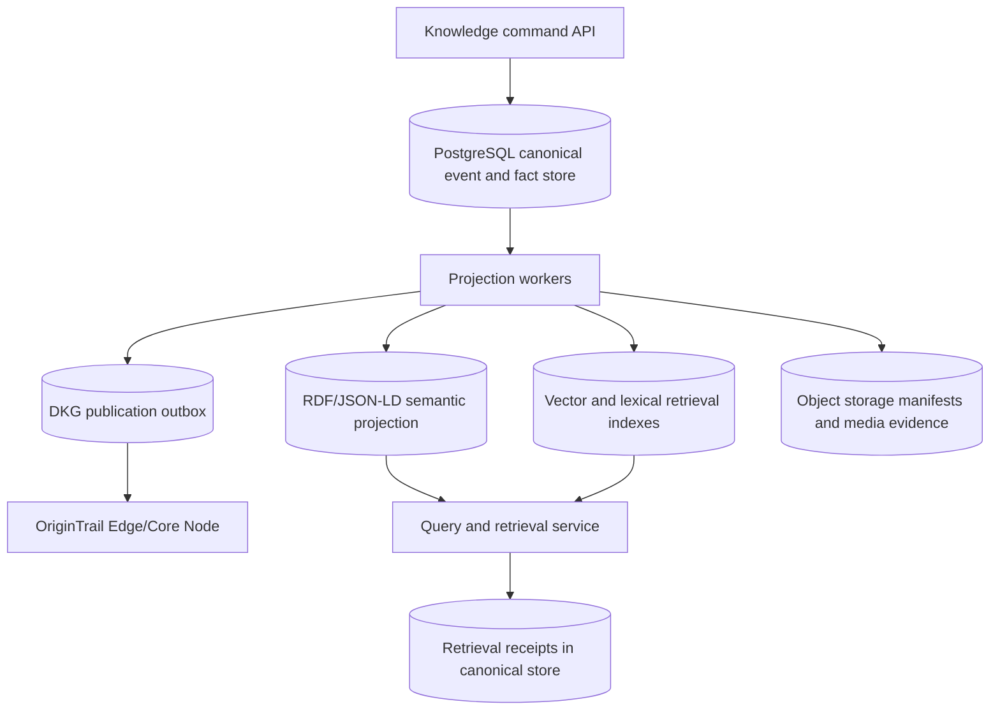
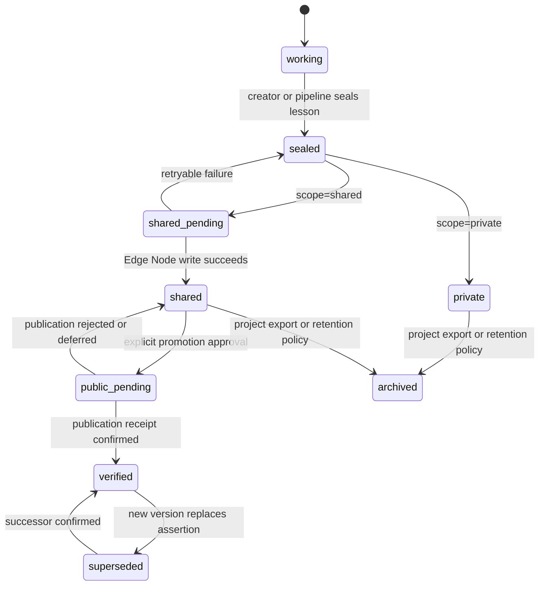
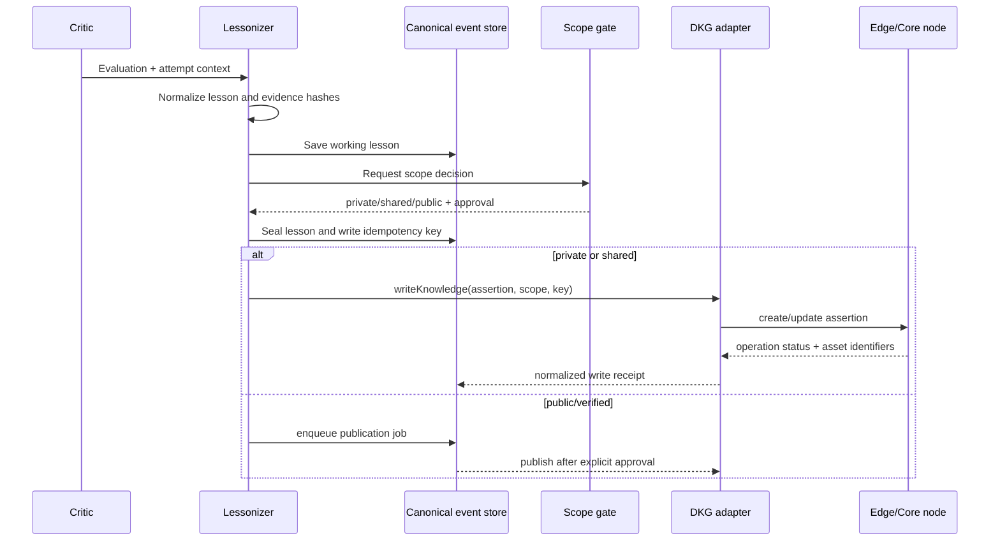

# CineGraph Context Graph Design

**Status:** Proposed architecture for implementation

**Decision:** Build CineGraph Production Core as a content-addressed, event-sourced, bitemporal knowledge system whose canonical semantic projection is RDF/JSON-LD and whose controlled private/shared/public distribution is provided by OriginTrail DKG.

**Date:** 2026-09-16

## 1. Purpose

CineGraph is the creative-knowledge layer for OpenCinema. It turns production attempts into reusable, provenance-backed knowledge that an agent can retrieve before a later attempt. The first user-visible proof is:

```text
creator intent
  -> ScenePlan
  -> Try 1 artifact
  -> independent Evaluation
  -> ImprovementLesson
  -> DKG write/readback
  -> revised Director instruction
  -> Try 2 artifact
```

The success condition is not that an LLM score goes up. The system must make it possible to inspect which named knowledge assets were retrieved, which decisions they changed, and how the resulting artifact is related to the earlier attempt.

This document defines the domain model, runtime architecture, data flows, boundaries, privacy rules, failure behavior, production controls, and delivery stages for that system. The architecture selection and elimination record is in [CineGraph Production Architecture Selection](2026-09-16-cinegraph-architecture-selection.md).

## 2. Context and constraints

The current repository describes three product layers:

```text
OpenCinema -> creator-facing ecosystem
Manga Studio -> first focused workflow
CineGraph -> creative knowledge, retrieval, provenance, lineage
OriginTrail DKG -> structured, selectively shared, verifiable memory
```

The existing application is a local-first Node.js/Express and React workspace. Projects, chapters, pages, panels, generated assets, generation history, and settings are persisted by server-side stores. Livepeer Agent is the intended media execution layer. CineGraph must become a production service boundary rather than extending file-backed application state into a pseudo-database. Development fixtures may be local, but production persistence requires transactional database storage, governed object storage, durable workers, migrations, backups, and observability.

OriginTrail provides the underlying graph and trust primitives:

- Knowledge Assets contain graph-shaped RDF knowledge and can be identified by a UAL.
- Assertions can be verified through cryptographic fingerprints of their n-quads content.
- Edge Node or private knowledge can remain owner-controlled.
- Shared or public publication is an explicit lifecycle decision and consumes network resources.
- RDF and SPARQL support exact graph queries; vector or free-text retrieval supports semantic recall.

Sources: [repository DKG research](../../research/ORIGINTRAIL.md), [OriginTrail key concepts](https://docs.origintrail.io/dkg-key-concepts), [basic Knowledge Asset operations](https://docs.origintrail.io/getting-started/basic-knowledge-asset-operations), and [DKG MCP integration](https://docs.origintrail.io/dkg-knowledge-hub/learn-more/dkg-key-concepts/using-mcp-on-your-dkg-node).

## 3. Goals

1. Make lessons from one creative attempt retrievable by the next attempt.
2. Preserve immutable local lineage for every attempt, evaluation, lesson, and retrieval.
3. Use OriginTrail DKG as the graph-backed memory layer without storing raw media bytes or private prompts in the graph.
4. Keep private, shared, and public/verified knowledge visibly distinct.
5. Make every retrieval explainable: source asset, confidence, scope, and the Director decision it influenced.
6. Allow a lesson created locally to be promoted later without changing its semantic identity.
7. Keep the first vertical slice useful with a local DKG Edge Node and deterministic contract fixtures for tests, without treating fixtures as production storage.
8. Provide enough evidence to distinguish “knowledge was retrieved and used” from “the artifact improved.”

## 4. Non-goals for the first release

- A token, wallet, NFT marketplace, DAO, or social feed.
- Storing image/video/audio bytes in OriginTrail.
- Publishing every prompt, draft, script, critique, or intermediate artifact.
- Replacing Livepeer, image models, video models, or a general model router.
- A general-purpose ontology for all cinema before the Manga Studio loop is proven.
- Claiming quality improvement from a single judge score or one happy-path demo.

## 5. Architectural principles

### 5.1 Local-first, promotion-aware

All writes begin as transactions in the canonical event store. A graph record receives an explicit scope:

```text
private -> team/shared -> public/verified
```

The default is `private`. Promotion requires a user or policy decision, a privacy check, and a receipt. Publication is never an incidental side effect of saving a draft.

### 5.2 Evidence is a first-class output

The system records the causal chain, not just the final artifact:

```text
retrieved asset IDs
  -> retrieval result
  -> Director instruction delta
  -> generation attempt
  -> evaluation
```

Every edge in that chain has a stable local ID and timestamps. DKG identifiers are additive evidence, not a replacement for the canonical event history.

### 5.3 Semantic lessons over raw transcripts

The shared graph contains compact, reviewable observations: what failed, under which conditions, the recommended intervention, supporting evidence, and confidence. Raw prompts, private text, and media remain local or in the artifact store.

### 5.4 Separate observation from prescription

An `Evaluation` reports what happened. An `ImprovementLesson` proposes what to try next. A Director may use a lesson only when its scope and conditions match the current attempt.

### 5.5 DKG behind an adapter

Application code depends on a CineGraph port, not directly on DKG HTTP details or SDK versions. This allows local fixtures, an Edge Node, and future public-network publication to share the same domain contracts.

### 5.6 Canonical knowledge is immutable and replayable

The canonical record is an append-only knowledge event plus a content-addressed payload. PostgreSQL provides the transactional materialization of that record. Every projection records the source event sequence and projection version, so a semantic view, vector index, or DKG assertion can be rebuilt and compared against its expected hash.

### 5.7 Facts have two times

Every assertion has valid time, meaning when the creative claim applies in the modeled world, and transaction time, meaning when CineGraph accepted or revised the claim. This prevents a later correction from erasing what the system knew at an earlier point and supports reproducible retrieval for a historical generation attempt.

### 5.8 Derived indexes never become hidden authorities

Full-text, vector, property-graph, analytics, and DKG views are derived indexes. They may accelerate retrieval or distribution, but their records point back to canonical event IDs and projection checkpoints. A result without a resolvable provenance chain is not eligible for Director context.

## 6. System architecture

```mermaid
flowchart LR
    Creator[Creator intent] --> Director[Director service]
    Director --> Ledger[(PostgreSQL event and fact store)]
    Director --> Plan[ScenePlan / PanelPlan]
    Plan --> Media[Livepeer Agent]
    Media --> ArtifactStore[(Artifact store)]
    ArtifactStore --> Ledger
    Ledger --> Critic[Independent critic]
    Critic --> Evaluation[Evaluation]
    Evaluation --> Lessonizer[Lessonizer]
    Lessonizer --> Lesson[ImprovementLesson]
    Lesson --> Scope{Privacy and scope gate}
    Scope -->|private/shared| Edge[DKG Edge Node adapter]
    Scope -->|public/verified| Publish[Explicit publication worker]
    Edge --> DKG[(OriginTrail DKG)]
    Publish --> DKG
    DKG --> Query[Hybrid retrieval service]
    Query --> Receipt[Retrieval receipt]
    Receipt --> Director
    Ledger --> Compare[Lineage and comparison UI]
    Receipt --> Compare
```



### 6.1 Components

| Component | Responsibility | Does not own |
| --- | --- | --- |
| `CineGraph domain` | IDs, ontology, schemas, scopes, validation, normalized receipts | Network calls, media bytes |
| `Knowledge event store` | Immutable events, bitemporal facts, idempotency, authorization, replay checkpoints | Public graph truth |
| `Semantic projection` | Canonical JSON-LD/RDF/n-quads, validation, graph query model | Transaction orchestration |
| `Evidence and media store` | Media bytes, manifests, hashes, transformations, retention and legal holds | Semantic graph state |
| `DKG adapter` | Context Graph setup, write/read/query, UAL and proof metadata normalization | Product-specific lesson generation |
| `Ingestion pipeline` | Convert evaluations and approved observations into graph assertions | Silent publication |
| `Retrieval service` | Hybrid semantic + exact retrieval, filtering, ranking, evidence receipt | Editing a project without a caller decision |
| `Director` | Turn creator intent plus retrieved context into a structured plan/instruction | Deciding whether knowledge is public |
| `Critic` | Evaluate an artifact against preregistered criteria without hidden memory | Writing lessons directly to public memory |
| `Artifact store` | Store media bytes and references/hashes | Semantic graph state |
| `Publication worker` | Perform explicit shared/public promotion and record network receipts | Selecting content without policy approval |

### 6.2 Production data plane



The production boundary is transactional at the command/event store and eventually consistent at derived projections. The API reports projection lag and DKG publication status explicitly. It never presents a stale projection as if it were the canonical current state.

### 6.3 Required ports

The application-facing interfaces should be stable even if the implementation changes:

```js
// The adapter owns DKG protocol details and returns normalized domain receipts.
const cineGraph = {
  ensureContextGraph({ projectId, graphId }),
  writeKnowledge({ assertion, scope, idempotencyKey }),
  readKnowledge({ knowledgeId, scope }),
  queryKnowledge({ query, scope, projectId }),
  promoteKnowledge({ knowledgeId, fromScope, toScope, approval }),
};

// The retrieval service is the only caller the Director needs to know about.
const retrieval = {
  retrieve({ projectId, query, filters, limit, purpose }),
};
```

All methods are asynchronous, idempotent where a write is involved, and return a receipt containing `operationId`, `knowledgeId`, `scope`, `status`, and any DKG identifiers.

## 7. Memory lifecycle



The initial implementation must support `working`, `sealed`, `private`, `shared_pending`, `shared`, `public_pending`, `verified`, and `failed` states. A failed write never erases the local lesson.

## 8. CineGraph ontology v1

### 8.1 Namespace

Use a project-controlled namespace for CineGraph terms and standard namespaces for provenance and schema vocabulary:

```json
{
  "cg": "https://cinegraph.opencinema.dev/ontology/1#",
  "schema": "https://schema.org/",
  "prov": "http://www.w3.org/ns/prov#",
  "xsd": "http://www.w3.org/2001/XMLSchema#"
}
```

The namespace is versioned at the ontology level. Entity IDs use opaque, stable IDs such as `urn:cinegraph:project:proj_123` and must not contain private filesystem paths, prompt text, or user email addresses.

### 8.2 Core classes

| Class | Meaning | Required identity fields |
| --- | --- | --- |
| `CreativeProject` | A bounded creative workspace | `id`, `name`, `domain`, `createdAt` |
| `ScenePlan` | Director’s structured plan for a scene | `id`, `projectId`, `version`, `intentHash` |
| `PanelPlan` | Executable visual unit inside a scene/page | `id`, `scenePlanId`, `order`, `continuityRefs` |
| `CharacterIdentity` | Stable character constraints | `id`, `name`, `featuresHash`, `scope` |
| `StyleIdentity` | Reusable visual language constraints | `id`, `name`, `styleHash`, `scope` |
| `GenerationAttempt` | One immutable generation request and result | `id`, `planId`, `attemptNumber`, `status` |
| `Artifact` | A generated or reviewed media output | `id`, `contentHash`, `mediaType`, `uri` |
| `ArtifactProvenance` | Provider/model/input lineage for an artifact | `id`, `artifactId`, `provider`, `model`, `createdAt` |
| `Evaluation` | Independent observations about an artifact | `id`, `artifactId`, `criteriaVersion`, `scores` |
| `ImprovementLesson` | A bounded recommendation derived from evidence | `id`, `evaluationId`, `condition`, `recommendation`, `confidence` |
| `CreativeTechnique` | A reusable production method or pattern | `id`, `name`, `description`, `scope` |
| `ModelObservation` | Provider/model behavior observed in context | `id`, `model`, `observation`, `evidenceRefs` |
| `RetrievalReceipt` | What knowledge was retrieved and used | `id`, `queryHash`, `resultRefs`, `usedBy` |
| `Remix` | A derivative creative use of prior knowledge | `id`, `sourceRefs`, `creatorRef`, `createdAt` |

### 8.3 Relationships

The minimum relationship vocabulary is:

```text
CreativeProject HAS_SCENE_PLAN ScenePlan
ScenePlan HAS_PANEL_PLAN PanelPlan
PanelPlan REFERENCES_CHARACTER CharacterIdentity
PanelPlan REFERENCES_STYLE StyleIdentity
GenerationAttempt EXECUTES_PLAN ScenePlan|PanelPlan
GenerationAttempt PRODUCED_ARTIFACT Artifact
Artifact HAS_PROVENANCE ArtifactProvenance
Evaluation EVALUATES Artifact
Evaluation GENERATED_LESSON ImprovementLesson
ImprovementLesson APPLIES_TO ScenePlan|PanelPlan|CharacterIdentity|StyleIdentity
GenerationAttempt USED_KNOWLEDGE ImprovementLesson|CreativeTechnique|ModelObservation
RetrievalReceipt RETRIEVED KnowledgeAssetRef
RetrievalReceipt INFLUENCED GenerationAttempt|ScenePlan
Remix DERIVED_FROM ImprovementLesson|CreativeTechnique|Artifact
```

`USED_KNOWLEDGE` and `INFLUENCED` are mandatory for the Try 2 proof. Merely returning a search result does not prove that the Director used it.

### 8.4 Lesson shape

An `ImprovementLesson` must contain:

```text
condition       observable situation where the lesson applies
failureMode     compact description of what went wrong
recommendation  concrete intervention for a future plan
scope           private | shared | public
confidence      low | medium | high
evidenceRefs    hashes or stable IDs, never raw private content
validFor        domain/model/style/medium constraints
createdFrom     Evaluation ID and attempt ID
supersedes      optional prior lesson ID
```

Example JSON-LD assertion:

```json
{
  "@context": {
    "cg": "https://cinegraph.opencinema.dev/ontology/1#",
    "schema": "https://schema.org/",
    "prov": "http://www.w3.org/ns/prov#"
  },
  "@id": "urn:cinegraph:lesson:lesson_hair_scar_anchor_v1",
  "@type": "cg:ImprovementLesson",
  "schema:name": "Anchor the scar and hair silhouette in every panel",
  "cg:condition": "The same character appears in multiple portrait panels and identity drift is visible between generations.",
  "cg:failureMode": "The scar and hair silhouette were omitted in the first generated panel.",
  "cg:recommendation": "Add the scar location and hair silhouette to the character constraint block and compare each panel against the accepted reference before generation.",
  "cg:confidence": "medium",
  "cg:scope": "shared",
  "cg:createdFrom": "urn:cinegraph:evaluation:eval_01",
  "cg:evidenceHash": "sha256:...",
  "prov:wasDerivedFrom": "urn:cinegraph:attempt:try_1"
}
```

## 9. Identity, versioning, and provenance

### 9.1 Two IDs for every important object

Every domain object has:

1. A local opaque ID used by the canonical event store, such as `lesson_01J...`.
2. A semantic graph ID used in JSON-LD, such as `urn:cinegraph:lesson:<stable-id>`.

The DKG UAL is stored separately when available. A UAL is a network locator and must not be used as the only local foreign key because local work can exist before publication and public assets can change network.

### 9.2 Content addressing and canonicalization

Every payload that can affect a creative conclusion receives a cryptographic content hash after canonical serialization. JSON-LD is expanded and normalized into deterministic n-quads before hashing. The canonicalization algorithm and hash algorithm are stored with the payload. Hashes cover the semantic payload, not volatile transport fields such as request IDs or timestamps.

The system stores a Merkle link from each derived assertion to its source event IDs and evidence manifests. This supports integrity checks, deduplication, portable exports, and proof that a DKG projection came from a specific local history.

### 9.3 Immutable attempts, append-only revisions

`GenerationAttempt`, `Evaluation`, `RetrievalReceipt`, and publication operations are append-only. Corrections create a successor with `supersedes`; they never mutate the meaning of a completed attempt.

The canonical event store and its evidence manifests store:

- request and plan hashes;
- provider, model, capability, and job references;
- artifact URI and content hash;
- evaluation criteria version and result;
- lesson IDs and DKG write receipts;
- retrieved knowledge IDs and Director input hash;
- publication scope and approval record.

### 9.4 Bitemporal validity

Facts and lessons carry `validFrom`, `validTo`, `recordedAt`, and `supersededBy` where applicable. Retrieval for a new attempt uses the current valid view; replay of an old attempt uses the view that was eligible at that attempt’s transaction time. A correction is a new event and never overwrites historical evidence.

### 9.5 Provenance minimum

For each assertion, preserve `prov:wasDerivedFrom`, `prov:wasGeneratedBy`, and creation time where the vocabulary can express it. The local receipt must additionally preserve the exact input hash and adapter version used to produce the assertion.

## 10. Write pipeline



The write pipeline must be idempotent. The idempotency key is derived from the lesson semantic ID, assertion version, scope, and adapter schema version. A retry must read the existing receipt before attempting another billed or on-chain operation.

## 11. Retrieval architecture

Retrieval is a two-stage process:

1. **Recall:** free-text or embedding search over eligible private/shared/public knowledge, constrained by project scope and creative domain.
2. **Precision:** SPARQL or structured filters verify entity, medium, model, style, conditions, confidence, and supersession state.

The ranking policy is:

```text
eligible scope
  -> current, non-superseded assertions
  -> same project/shared workspace
  -> same medium and workflow
  -> matching character/style/model conditions
  -> semantic relevance
  -> confidence and provenance quality
  -> recency as a tie-breaker
```

The retrieval response contains only bounded context:

```json
{
  "receiptId": "retrieval_01J...",
  "queryHash": "sha256:...",
  "purpose": "revise-scene-plan",
  "results": [
    {
      "knowledgeId": "lesson_hair_scar_anchor_v1",
      "source": "shared",
      "ual": null,
      "relevance": 0.91,
      "confidence": "medium",
      "condition": "...",
      "recommendation": "...",
      "evidenceRefs": ["eval_01"]
    }
  ],
  "filters": {
    "projectId": "proj_123",
    "medium": "manga",
    "styleId": "style_seinen_01"
  }
}
```

The Director must echo the selected `knowledgeId`s in its revised plan. This creates a mechanical check for `USED_KNOWLEDGE` rather than relying on UI claims.

## 12. API surface

The first server integration should expose narrow project-scoped endpoints:

```text
POST /api/projects/:id/cinegraph/lessons
GET  /api/projects/:id/cinegraph/lessons/:lessonId
POST /api/projects/:id/cinegraph/lessons/:lessonId/seal
POST /api/projects/:id/cinegraph/lessons/:lessonId/promote
POST /api/projects/:id/cinegraph/query
GET  /api/projects/:id/cinegraph/receipts/:receiptId
GET  /api/projects/:id/cinegraph/lineage/:attemptId
```

All endpoint responses are JSON and include `requestId`. The write endpoints return `202` for queued network work and `200` for local-only completion. No endpoint returns wallet private keys, raw prompt text by default, or unredacted DKG payloads that violate the requested scope.

## 13. Persistence and operational behavior

Production CineGraph uses PostgreSQL as the transactional canonical store. The minimum logical tables are:

```text
knowledge_events
knowledge_entities
knowledge_facts
evidence_manifests
projection_checkpoints
retrieval_receipts
outbox_operations
publication_receipts
consent_and_policy_decisions
schema_migrations
```

`knowledge_events` is append-only and contains event type, aggregate ID, actor, tenant/project, payload hash, canonical payload reference, transaction time, and idempotency key. `knowledge_facts` is a bitemporal materialization keyed by subject/predicate/object plus valid-time and transaction-time ranges. All mutations use database transactions and optimistic concurrency where an aggregate has a current revision.

Raw media and larger private evidence are stored in S3-compatible object storage behind immutable manifests. A manifest records content hash, media type, byte size, encryption key reference, retention class, legal hold, and the event that introduced it. DKG assertions contain hashes and approved references, never bulk media bytes.

The outbox is a transactional table, not a best-effort in-memory queue. Network failures use bounded exponential backoff with a dead-letter state. Workers claim rows with leases, renew long operations, and reconcile ambiguous timeouts by querying the remote operation before retrying. Every projection stores a checkpoint and lag metric. Backups include database point-in-time recovery, object-storage versioning, encryption metadata, and projection rebuild instructions.

Development may use an embedded fixture adapter, but it must implement the same contract and must never be described as production durability.

## 14. Privacy, security, and trust

### 14.1 Data classification

| Data | Default location | Share rule |
| --- | --- | --- |
| Raw prompts and scripts | Governed private storage | Never shared by default |
| Generated media bytes | Artifact store | Share URI/hash only when approved |
| API keys and wallet keys | Server environment/secret store | Never serialized into project or graph |
| Lesson text | Local working memory | Share only after minimization check |
| Stable IDs and hashes | Local/shared graph | Safe when they reveal no private path or identity |
| Evaluation summary | Local/shared graph | Share after removing personal or unreleased details |
| UAL/network receipt | Local receipt, optionally UI | Public only when asset is public |

### 14.2 Policy checks

Before a lesson enters shared or public scope, validate:

- no credential-shaped values;
- no absolute local paths;
- no raw prompt/script unless explicitly allowed by policy;
- no unapproved personal information;
- media represented by hash/reference rather than bytes;
- scope and project consent are present;
- evidence refs resolve to stable records.

### 14.3 Trust states

The UI and API must distinguish:

```text
local/unverified
shared/edge-node
public/published
public/verified
superseded
```

“Stored in DKG” is not equivalent to “verified improvement.” Verification of data integrity and proof that a lesson improves an output are separate claims.

### 14.4 Tenant isolation and key management

Every production query is tenant- and project-scoped before semantic ranking. Database authorization is enforced in the service layer and, where available, database row-level security. DKG credentials, signing keys, object-storage encryption keys, and webhook secrets are held in a secret manager or deployment secret store, rotated independently, and never included in event payloads or exports. Remote callbacks are authenticated and replay-protected.

## 15. Evaluation and evidence

The implementation should produce an evidence ledger for each demonstration or benchmark case:

```text
caseId
inputFingerprint
try1AttemptId
evaluationId
lessonId
writeReceiptId
retrievalReceiptId
try2AttemptId
knowledgeUsedIds
artifactHashes
criticResults
manualTiming
```

Required claims are phrased narrowly:

- “A lesson was created from Evaluation X.”
- “The lesson was written to scope Y and read back through receipt Z.”
- “The revised Director plan explicitly used knowledge IDs A and B.”
- “In N held-out cases, M cases completed the real loop.”

Do not report a quality uplift without a held-out set, a defined critic protocol, failures in the denominator, and a comparison against a timed manual or no-memory baseline.

## 16. Production readiness and operations

Production readiness includes more than a successful DKG round trip:

- point-in-time database recovery and object-store restore have been exercised;
- projection workers can replay a selected event range into a new schema version;
- DKG outbox retries reconcile ambiguous remote outcomes without duplicate publication;
- dashboards expose event commit latency, projection lag, retrieval latency, DKG operation age, dead-letter counts, hash mismatches, and privacy-policy rejects;
- audit logs record actor, tenant, consent, authorization decision, and affected knowledge IDs;
- deletion and export policies distinguish private source material, derived assertions, and public immutable assets;
- schema migrations have forward/backward compatibility rules and a tested rollback strategy;
- retrieval changes are evaluated against a fixed benchmark before ranking changes reach production.

## 17. Delivery stages

### Stage 0: production contracts and local conformance

Define ontology constants, event schemas, bitemporal semantics, canonicalization, deterministic IDs, redaction, authorization, and DKG receipts. Tests run without a node or wallet, but fixtures use production-shaped events and projection checkpoints.

### Stage 1: transactional canonical core

Implement PostgreSQL migrations, immutable events, bitemporal facts, content-addressed payloads, object manifests, transactionally persisted retrieval receipts, and replayable semantic projections. Demonstrate the loop against a local fixture adapter without making the fixture the production persistence design.

### Stage 2: retrieval and projection quality

Add exact graph queries, semantic retrieval, applicability filters, ranking evaluation, projection checkpoints, and reproducible historical views. Verify that every result resolves to canonical events and evidence manifests.

### Stage 3: real Edge Node integration

Run a local OriginTrail DKG Edge Node in Working Memory and Shared Working Memory. Ensure a Context Graph, write the lesson assertion through the durable outbox, query/read it back, reconcile receipts, and surface projection lag and verification status.

### Stage 4: Manga Studio integration

Connect the real critic, lessonizer, Director, and Livepeer attempt ledger. Display the lesson and knowledge-used lineage in the existing workflow while preserving a complete canonical event trail.

### Stage 5: explicit public promotion and operations

Add approval, outbox, publication receipt, UAL display, verification instructions, key management, backup/restore, alerts, and production runbooks. Publish only minimized lessons on a supported network when credentials and funding are available.

### Stage 6: broader CineGraph reuse

Add storyboard/shot/video adapters only after the canonical contracts, projections, migration tests, and evidence benchmarks are production-stable. Extend the ontology through additive terms and versioned contexts.

## 18. Architectural decisions

| Decision | Choice | Reason |
| --- | --- | --- |
| First product shape | Staged hybrid | Proves value quickly without baking manga assumptions into network contracts |
| Source of truth | Immutable event log materialized in PostgreSQL | Preserves history, bitemporal views, transactions, and replay |
| Semantic authority | Canonical JSON-LD/RDF projection | Interoperability, exact graph queries, and DKG compatibility |
| Integrity | Content hashes and Merkle links | Detects drift and makes projections/export verifiable |
| Media boundary | Governed object storage plus immutable manifests | Keeps bulk bytes out of semantic and public graph layers |
| Network boundary | Adapter and outbox | Isolates SDK/API churn and handles slow/failed writes |
| Graph payload | Minimized JSON-LD/RDF assertions | Enables semantic retrieval without leaking private creative material |
| Retrieval | Hybrid semantic recall + exact graph filters | Balances natural creative queries with precise constraints |
| Publication | Explicit approval only | Publishing spends resources and changes exposure |
| Versioning | Append-only events plus bitemporal facts | Supports corrections, historical replay, and valid-time applicability |
| Quality claim | Evidence-led, not score-led | A changed prompt and a better artifact are different facts |

## 19. Risks and mitigations

| Risk | Impact | Mitigation |
| --- | --- | --- |
| DKG API or v10 behavior changes | Integration churn | Keep the adapter small; pin and record adapter version; use contract tests |
| Shared lesson leaks private story details | Privacy harm | Redaction/classification gate and minimized assertion schema |
| Retrieval returns plausible but irrelevant lessons | Bad generations | Exact filters, applicability fields, confidence, and visible receipts |
| Duplicate billed/network writes | Cost and inconsistent state | Deterministic idempotency keys and outbox reconciliation |
| UI implies memory caused quality improvement | Misleading demo | Separate used-knowledge and quality evidence in the ledger |
| Local ledger and DKG diverge | Confusing state | Receipts, explicit statuses, reconciliation endpoint, append-only events |
| Projection silently drifts from canonical events | Incorrect retrieval or publication | Checkpointed replays, canonical hashes, drift alerts, rebuild tooling |
| Database or object store loss | Permanent evidence loss | Point-in-time backups, object versioning, restore drills, export manifests |
| Tenant or project isolation fails | Confidentiality breach | Scope-first authorization, row-level policy, red-team tests, audit logging |
| Schema changes invalidate old lessons | Broken retrieval and lineage | Versioned ontology, migration registry, dual-read/dual-write rollout, replay tests |
| Ontology grows too early | Slow delivery | Start with v1 classes and additive extension policy |

## 20. Acceptance criteria for the first production slice

The slice is complete only when all of these are observable:

1. A Manga Studio attempt is saved in a transaction before generation begins.
2. Try 1 produces an artifact hash, immutable event, evidence manifest, and bitemporal attempt record.
3. The critic produces an evaluation without receiving hidden retrieved memory.
4. A lesson is derived from the evaluation and passes the scope/redaction checks.
5. The canonical RDF projection is deterministically hashable and replayable from its source events.
6. A durable outbox and real or faithfully contract-tested DKG adapter writes the lesson idempotently and reconciles ambiguous outcomes.
7. The same lesson is queried/read back and a retrieval receipt is saved with source event IDs and projection checkpoints.
8. The revised Director plan names the retrieved lesson IDs.
9. Try 2 retains separate lineage from Try 1 and records `USED_KNOWLEDGE`.
10. The UI can show the chain and current privacy/trust state.
11. Tests cover successful writes, retries, duplicate writes, DKG unavailability, redaction failure, supersession, retrieval filtering, replay, migration, backup/restore, tenant isolation, and projection drift.
